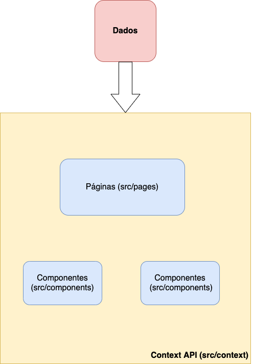
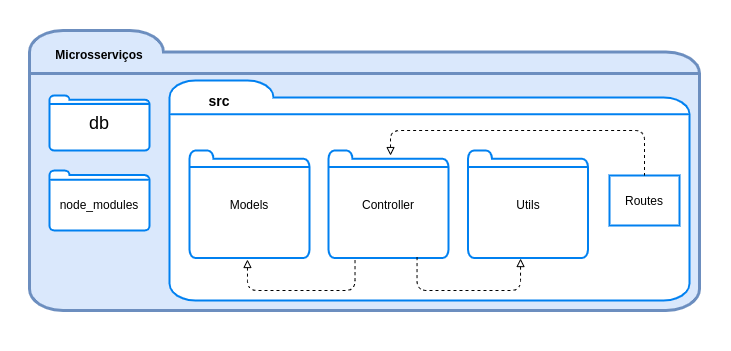
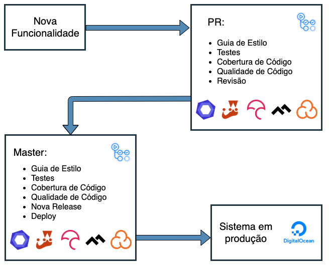

<h1 style='text-align: center;'>Documento de Arquitetura</h1>

## 1. Introdução

### Finalidade:

Esse documento de arquitetura tem como finalidade esclarecer e especificar decisões arquiteturais pertinentes durante o desenvolvimento do projeto, oferecendo uma visão geral das tecnologias e funcionalidades utilizadas.

### Escopo:

O SiGeD (Sistema de Gerenciamento de Demandas) consiste em uma aplicação web que visa facilitar a gerência dos processos da Divisão de Proteção à Saúde do Servidor (DPSS). 

Nesse documento de arquitetura, é feita uma descrição dos termos arquiteturais utilizados no desenvolvimento desse produto de software.

<h2>2. Representação da Arquitetura</h2>

### Diagrama de relações

O diagrama representa a divisão da aplicação em microsserviços de usuário, clientes e demandas e suas correlações.

### Diagrama React/Microsserviços

#### **REACT**
A aplicação web utiliza no front-end o framework React. A divisão é feita em *Pages*, *Services*, *Components* e *Constants*

* Pages: armazena as telas do website.

* Services: local onde são realizadas as comunicações com a API.

* Components: reúne os componentes utilizados nas telas da aplicação, como botões e a navbar.

* Constants: armazena os códigos das cores utilizadas. 

#### **MICROSSERVIÇOS**

Os microsserviços foram construídos utilizando Nodejs e o framework Express.js, onde cada microsserviço tem um banco de dados independente. Para o controle e armazenamento dos dados, foi empregado o banco de dados não relacional MongoDB. 

Dada a alta escalabilidade dos microsserviços, foram definidos quatro para essa aplicação, sendo eles o de usuários, responsável pela autenticação, o de demandas, clientes e de setores. O padrão JWT foi utilizado para fazer essa autenticação, portanto, um token é gerado no microsserviço de usuários e salvo na aplicação. Uma vez que haja um token válido, é possível fazer requisições em todos os microsserviços utilizando-o. 

### **Diagrama Context API**

A Context API é um recurso nativo do React que envolve toda a aplicação e, pode ser utilizado para fornecer estados globais para todos os elementos que necessitem dessa informação dentro da aplicação.

Esse recurso foi utilizado na aplicação principalmente para armazenar e utilizar os dados do usuário logado. Abaixo, é possível ver uma representação de como funciona e em qual parte do projeto esse recurso é utilizado.

## 3. Metas e Restrições de Arquitetura
Metas:

- Estabilidade do sistema
- Clareza na apresentação das funcionalidades
- Facil manutenção

Restrições: 

- **React:** framework javascript utilizado para a criação da interface do usuário
- **Node.js:** desenvolvimento dos microsserviços
- **MongoDB**: banco de dados não relacional

## 4. Visão de Implementação

### Modelagem de dados

### Diagrama de pacotes

#### **a) Frontend**

#### **b) Backend**

## 5. Pipeline de Integração e Deploy Continuos

## 6. Bibliografia

[Policia Civil do Estado de Goiás](https://www.policiacivil.go.gov.br/cpss), Acesso em: 19/03/2021, 11:14, Horário de Brasília.

[MongoDB](https://docs.mongodb.com/cloud/), Acesso em: 19/03/2021, 11:14, Horário de Brasília.

[ReactJS](https://pt-br.reactjs.org/docs/getting-started.html), Acesso em: 19/03/2021, 11:14, Horário de Brasília.

[NodeJS](https://nodejs.org/en/docs/), Acesso em: 19/03/2021, 11:14, Horário de Brasília.

[Express](http://expressjs.com/pt-br/guide/routing.html), Acesso em: 19/03/2021, 11:15, Horário de Brasília.
